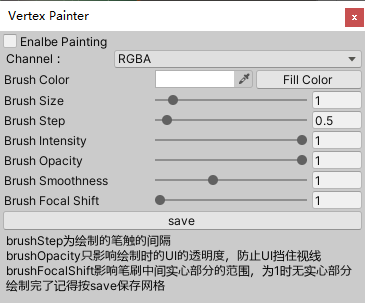

# Vertex Color Painter

###### 使用方法

- 给gameobject挂在VCObject.cs
- 点击Open Painter Window打开绘制窗口

- 打开Enalbe Painting就可以绘制了:-)

###### 参数

- Channel：选择你要绘制的通道
- Brush Color：笔刷颜色
- Brush Size：笔刷大小（实际大小=pow(brushSize, 2)/10）
- Brush Step：每个笔触之间的间距(太大的话笔触会不连续，太小的话同一个地方会画上很多笔)
- Brush Intensity：绘制的强度
- Brush Opacity：这个之后影响笔刷光标的透明度，降低一点可以防止UI挡住视线
- Brush Focal Shift：笔刷中间实心部分，为1时无实心部分
- save：保存网格

###### 参考资料

代码结构主要参考[**alpacasking**](https://github.com/alpacasking)的Simple Vertex Painter：

https://github.com/alpacasking/SimpleVertexPainter